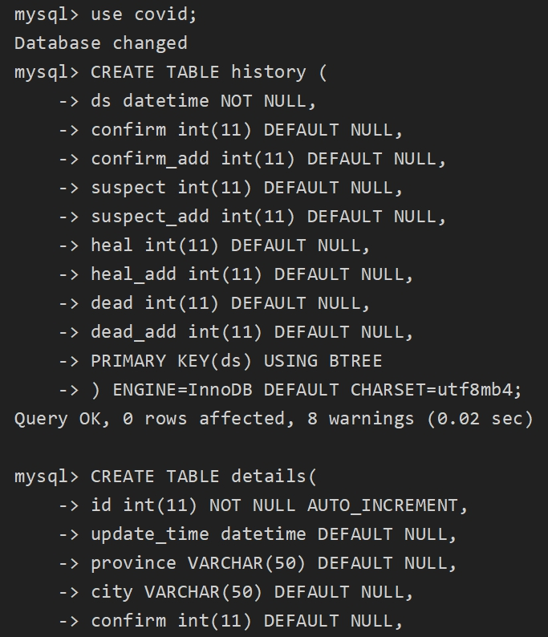

# Linux服务器部署疫情地图
**若图片无法正常显示，可从 [此处](https://zhuanlan.zhihu.com/p/516501658) 查看教程**

本文演示环境为ubuntu20.04
## 更新apt源
`sudo apt update`  
  
`sudo apt upgrade`  
安装需要的工具  
`sudo apt install git unzip`

## 下载项目源码
`git clone https://gitee.com/fitz161/covidMap.git`  
  
切换到项目根目录  


## 安装MySQL
### 安装最新版MySQL
`sudo apt install mysql-server`  
  
`systemctl status mysql` 查看MySQL服务是否正常运行  

### 安装其他版本MySQL
```
# 添加MySQL源  
wget https://repo.mysql.com//mysql-apt-config_0.8.22-1_all.deb

apt install ./mysql-apt-config_0.8.12-1_all.deb

# 安装指定版本MySQL
apt install mysql-server=5.7.31-1ubuntu18.04
```

## 安装chrome
下载并安装最新版本deb包  
`wget https://dl.google.com/linux/direct/google-chrome-stable_current_amd64.deb`

`apt install ./google-chrome-stable_current_amd64.deb`  
  

`apt install google-chrome-stable`   
出现下方内容说明chrome已经安装成功，还可以看到版本信息  
  

我们可以根据版本去 [官网](https://chromedriver.storage.googleapis.com/index.html) 下载对应版本的chromedriver，没有该版本时下载近似版本也可  
  
解压到项目根目录  
`unzip chromedriver_linux64.zip`

## 配置数据库
  
输入mysql进入MySQL命令行界面
```
# 修改root用户密码
ALTER USER 'root'@'localhost' IDENTIFIED BY 'root用户新密码'
# 创建新用户covid并设置密码
CREATE USER covid@'localhost' IDENTIFIED BY 'covid用户新密码';
# 给与covid用户访问权限 
GRANT ALL PRIVILEGES ON covid.* TO 'covid'@'localhost'
```
也可以不创建新用户，直接使用root账号操作数据库，这样可能会有安全上的问题   
  

复制database.txt的全部语句并在mysql命令行界面执行  
  

`show tables`  
出现这个界面说明数据库已经配置完成  


## 配置并启动项目
安装必需的第三方模块  
`pip install -r requirements.txt -i https://pypi.douban.com/simple`  
如果报错找不到pip，换成pip3再重试，也可以安装pip  
  
  

使用vim等文本编辑器打开`config.py`， 修改数据库账号和密码，端口推荐改成80，这样在很多情况下不用配置防火墙，且可以直接通过IP/域名访问网站

手动更新一次数据  
  
启动服务  
  

浏览器输入服务器的`IP:端口号`，如果端口为80则直接输入IP即可，此时应该能打开我们的网页了

如果显示网络错误，则防火墙开启对于端口，并重启防火墙，同时在云服务器控制台放行该端口

## 后台运行服务
一般我们通过ssh工具连接到远程服务器，执行程序时，若连接断开，则该进程也会结束

使用下方的命令可以让程序运行在后台，退出终端后程序依然会在后台执行，并会将输出保存到 nohup.out 文件中  
`nohup python3 main.py &`

上述命令不够方便，我们可以安装终端工具screen  
`sudo apt install screen`  
新建一个终端 `screen -S covid`   
在该终端 中切换到项目目录并执行，然后使用组合键Ctrl+a, 再按下d 退出该screen终端  


下次我们可以通过 `screen -r covid` 重新连接到该终端，并查看进程运行情况
